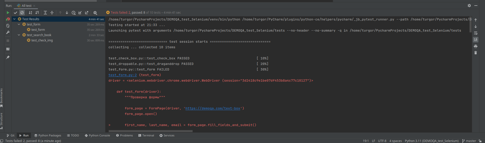
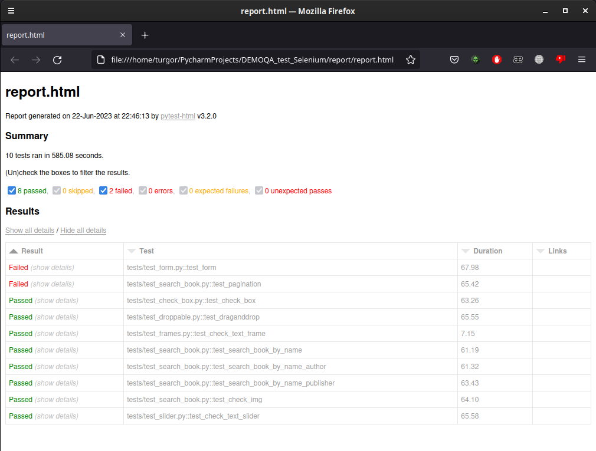

# DEMOQA test Selenium

## Описание

Цель проекта: получение навыков в написание автоматизированных авто тестов на Python.
Сайт для тестирования (<a href="https://demoqa.com">DEMOQA</a>).

## Окружение

Для того чтобы запустить тесты надо установить браузер chromium.

## Технологии

- Python 3.11.2
- PyTest
- PyTest html
- Selenium

# Состав проекта

- Папка (tests) с Python тестами
- Папка (report) c отчётами

## Selenium тесты

Пример запуска Selenium тестов:

## Отчет по Selenium тестам

Пример отчета по Selenium тестам

